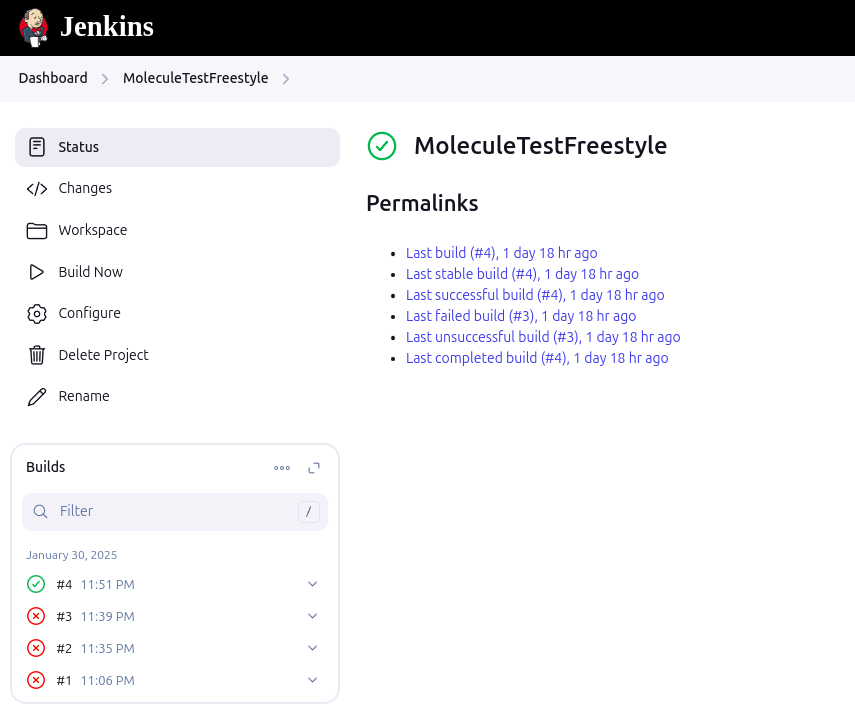
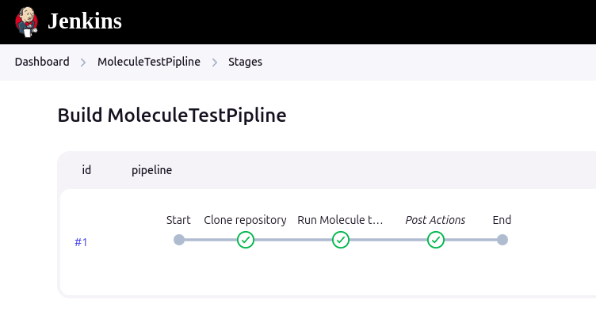
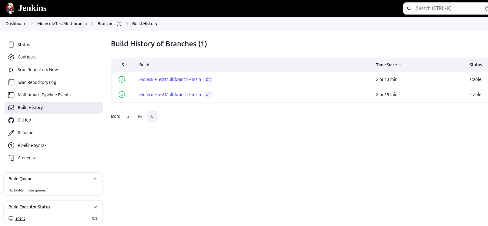
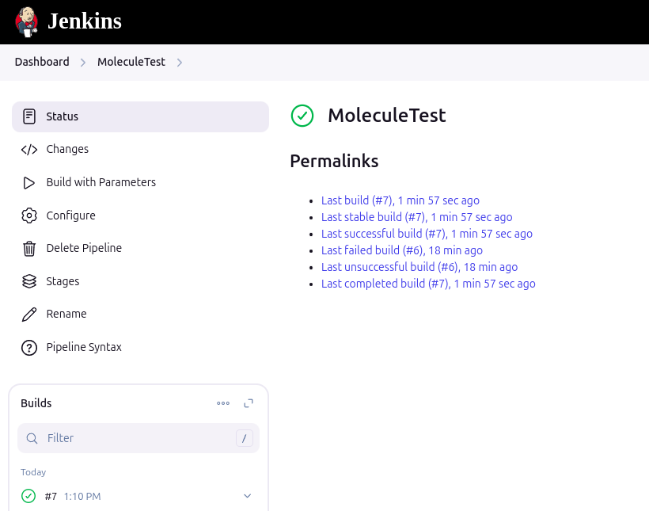

# Домашнее задание к занятию 10 «Jenkins»

## Подготовка к выполнению

1. Создать два VM: для jenkins-master и jenkins-agent.
2. Установить Jenkins при помощи playbook.
3. Запустить и проверить работоспособность.
4. Сделать первоначальную настройку.

## Основная часть

1. Сделать Freestyle Job, который будет запускать `molecule test` из любого вашего репозитория с ролью.



```
# Переход в рабочую директорию
cd /opt/jenkins_agent/workspace/MoleculeTestFreestyle

# Проверка, существует ли директория ansible_role_unbound
if [ ! -d "ansible_role_unbound" ]; then
    # Если директория не существует, клонируем репозиторий
    git clone https://github.com/drumspb/ansible_role_unbound
fi

# Переход в директорию ansible_role_unbound
cd ansible_role_unbound

# Обновление директории, если она уже существует
git pull

# Установка зависимостей и запуск тестов
molecule test
```

2. Сделать Declarative Pipeline Job, который будет запускать `molecule test` из любого вашего репозитория с ролью.



```
pipeline {
    agent any  // Задаем, что pipeline может быть выполнен на любом агенте

    stages {
        stage('Clone repository') {
            steps {
                script {
                    // Переход в рабочую директорию
                    dir('/opt/jenkins_agent/workspace/MoleculeTestPipline') {
                        // Проверка, существует ли директория ansible_role_unbound
                        if (!fileExists("ansible_role_unbound")) {
                            // Если директория не существует, клонируем репозиторий
                            git url: 'https://github.com/drumspb/ansible_role_unbound', branch: 'main'
                        } else {
                            // Если директория существует, просто обновляем её
                            dir('ansible_role_unbound') {
                                sh 'git pull'
                            }
                        }
                    }
                }
            }
        }

        stage('Run Molecule tests') {
            steps {
                script {
                    // Переход в директорию ansible_role_unbound и запуск тестов
                    dir('/opt/jenkins_agent/workspace/MoleculeTestFreestyle/ansible_role_unbound') {
                        // Установка зависимостей и запуск тестов
                        sh 'molecule test'
                    }
                }
            }
        }
    }

    post {
        always {
            // Очищаем рабочую директорию, если необходимо
            cleanWs()
        }
    }
}
```

3. Перенести Declarative Pipeline в репозиторий в файл `Jenkinsfile`.
4. Создать Multibranch Pipeline на запуск `Jenkinsfile` из репозитория.



5. Создать Scripted Pipeline, наполнить его скриптом из [pipeline](./pipeline).



```
node {
    // Параметризованный Build
    properties([
        parameters([
            booleanParam(name: 'prod_run', defaultValue: false, description: 'Запускать ansible-playbook без флагов --check --diff')
        ])
    ])

    dir('/opt/jenkins_agent/workspace/MoleculeTest') {
        // Проверка, существует ли директория ansible_role_unbound
        if (!fileExists("ansible_role_unbound")) {
            // Если директория не существует, клонируем репозиторий
            git url: 'https://github.com/drumspb/ansible_role_unbound', branch: 'main'
        } else {
            // Если директория существует, просто обновляем её
            dir('ansible_role_unbound') {
                sh 'git pull'
            }
        }
    }

    // Выполнение команды
    dir('/opt/jenkins_agent/workspace/MoleculeTest/ansible_role_unbound') {
        // Установка зависимостей и запуск тестов
        if (params.prod_run) {
            sh 'molecule test --no-check --no-diff'
        } else {
            sh 'molecule test'
        }
    }
}
```

6. Внести необходимые изменения, чтобы Pipeline запускал `ansible-playbook` без флагов `--check --diff`, если не установлен параметр при запуске джобы (prod_run = True). По умолчанию параметр имеет значение False и запускает прогон с флагами `--check --diff`.
7. Проверить работоспособность, исправить ошибки, исправленный Pipeline вложить в репозиторий в файл `ScriptedJenkinsfile`.
8. Отправить ссылку на репозиторий с ролью и Declarative Pipeline и Scripted Pipeline.
9. Сопроводите процесс настройки скриншотами для каждого пункта задания!!

## Необязательная часть

1. Создать скрипт на groovy, который будет собирать все Job, завершившиеся хотя бы раз неуспешно. Добавить скрипт в репозиторий с решением и названием `AllJobFailure.groovy`.
2. Создать Scripted Pipeline так, чтобы он мог сначала запустить через Yandex Cloud CLI необходимое количество инстансов, прописать их в инвентори плейбука и после этого запускать плейбук. Мы должны при нажатии кнопки получить готовую к использованию систему.

---

### Как оформить решение задания

Выполненное домашнее задание пришлите в виде ссылки на .md-файл в вашем репозитории.

---
